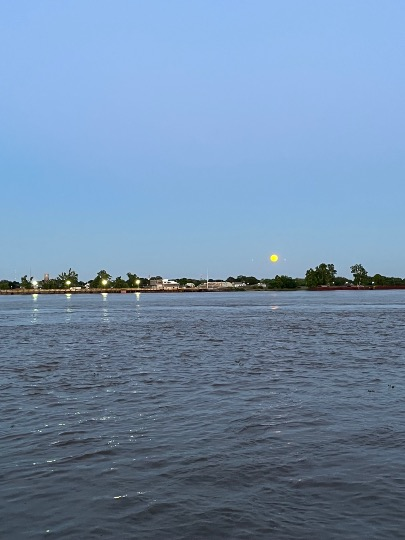



# The Environmental Health and Engineering Lab

> "The quality of life depends upon the ability of society to teach its members how to live in harmony with their environment—defined first as family, then the community, then the world and its resources."
>
> [Dr. Ellen Henrietta Swallow Richards (1842-1911)](https://en.wikipedia.org/wiki/Ellen_Swallow_Richards)

## Our Mission

Nearly 150 years later, our research group shares the dedication of Dr. Ellen Henrietta Swallow Vassar as we strive to protect environmental and human health from exposure to *microbial pathogens*. We now have advanced tools in microbiology, molecular microbiology, next-generation sequencing, long-read sequencing, bioinformatics, and statistics. Our research group is dedicated to integrating across disciplines to advance our knowledge of pathogen assessments at various sites (environmental, recreational, or drinking water) and ultimately to prevent infectious waterborne diseases. Microbial water quality research is experiencing an amazing period of growth, and we are helping to lead that effort. If you are interested in learning more about our work, please explore this site and feel free to [contact Huiyun](mailto:{{ site.email }}) with any questions.

## Our Lab

We are fortunate to reside within the [Department of Civil and Environmental Engineering](https://ce.wsu.edu/) at [Washington State University](http://www.wsu.edu), in the [Voiland College of Engineering and Architecture](https://vcea.wsu.edu/). Our department has a rich history of outstanding research and engineering practice in water quality, hydrology, and natural environment preservation and protection. Our lab is in the [PACCAR Environmental Technology Building](https://cplinc.com/work/projects/paccar-environmental-technology-building/), a hub of interdisciplinary research and education and a [Certified LEED New Construction Gold](https://lmnarchitects.com/project/paccar-environmental-technology-building-washington-state-university). We have direct access to qPCR, BSL2, BSL 2+ labs, [Illumina Sequencing](https://labs.wsu.edu/genomicscore/), [PacBio Sequencing](https://lbb.wsu.edu/), and genotyping. Over the years, we have benefited from rich collaborations with diverse colleagues in environmental engineering, microbiology, virology, and public health. These include Drs. [Irene Xagoraraki](https://www.egr.msu.edu/~xagorara/), [Joan Rose](https://rosejo.msu.domains/), [Marirosa Molina](https://www.researchgate.net/profile/Marirosa-Molina), and [Melissa Gonzales](https://sph.tulane.edu/enhs/melissa-gonzales). Through these great collaborations, we are passionate about addressing environmental challenges in environmental and human health.

## Learn More About Our Research Group

[Research](science)

[Members](members)

[Papers](papers)

	

		

			

				
			

			

				<h3>Join Us!</h3>
				
I am looking for exceptional and dedicated scientists and graduate students. It is important to me that we maintain a diverse team to synergize our experiences and interests. If you are interested in working towards a PhD at WSU, please [reach out](mailto:huiyun.wu@wsu.edu).

			

		

	



	

		

			

				
			

			

				<h3>Join Us!</h3>
				
River .

			

		

	




We conduct research at three levels. Firstly, we apply **molecular microbiology methods** to detect microbial waterborne pathogens and characterize temporal and spatial variations of pathogens in water systems. We use advanced sequencing techniques to study microbiomes in natural and built water environments as a framework for human, animal, and environmental health. This big data-driven analysis enables us to identify pathogens, novel microbial water indicators, and bacterial phages that can potentially combat antimicrobial resistance.

These studies empower our second level of research. We use environmental metagenomic data to **characterize microbiomes in environmental waters, identify waterborne diseases, and reduce health risks to the environment and humans**. We employ machine learning for microbiome discovery, especially virus communities in environmental water samples.

Lastly, we perform our research based on **Open Science and reproducible research principles**. We profile temporally and spatially separated samples (diagnosis, pre-treatment, post-treatment) to quantify changing clonal phylogenies during disease progression or in response to therapeutic intervention.







Our aim is to enhance resilience to water quality stresses due to climate change, promote water reuse, engage communities, and explore interdisciplinary fields like machine learning and environmental bioinformatics to mitigate the impacts of emerging waterborne microbial pollutants.

We benefit from a fully resourced computational and research environment at Washington State University. We have access to state-of-the-art computing and laboratory facilities to support truly ambitious and innovative research.







We like to perform ambitious research while operating in a fun, collaborative, and team-oriented environment. We are strongly committed to mentoring young scientists and engineers through internal and international internship schemes.

**Join us:** We are looking for inspiring, motivated individuals to join our team, challenge our current understanding of cancer biology, and help make new discoveries that will inform cancer care and improve patient outcomes.





